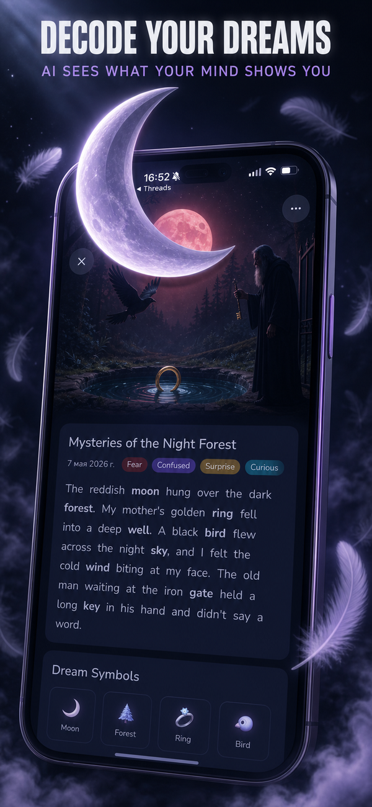
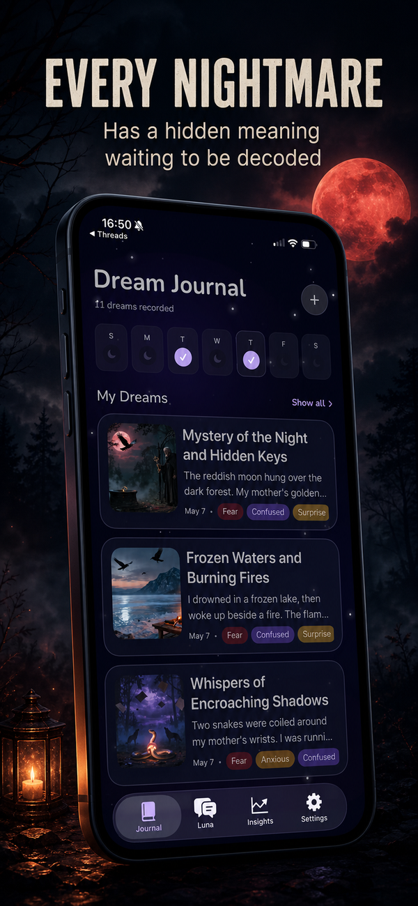
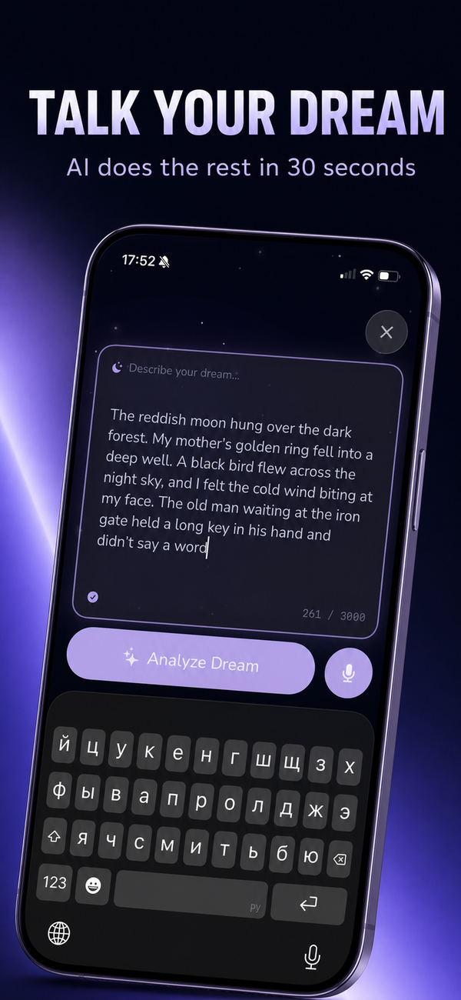

# ASO Studio

> Self-hosted open-source App Store toolkit for indie iOS developers — **keyword tracking, screenshot generation, video pipelines, and PPO experiments**, all in one place. Pair it with [Claude Code](https://claude.com/claude-code) and you get an AI co-pilot that actually understands your App Store.

Stop paying \$500/mo to Sensor Tower / AppTweak / SplitMetrics. ASO Studio runs on your machine, uses public APIs where possible, and stores everything locally.

<video src="https://github.com/dsm5e/aso-tracker/raw/main/docs/demo.mp4" controls width="100%"></video>

## What's inside

ASO Studio is a monorepo of three connected tools, accessible from a single dashboard:

| Tool | What it does |
|---|---|
| **Keywords** | Per-keyword, per-locale rank tracking across 50+ countries. Snapshot engine, week-over-week deltas, competitor intelligence. |
| **Screenshots** | App Store screenshot generator with AI hero enhancement (fal.ai gpt-image-2). Templates, scaffolds, headline overlays, locale translations. |
| **PPO Experiments** | Multi-strategy A/B treatment generator for App Store Product Page Optimization. Upload source screens once, generate per-strategy variants with different visual concepts, export ZIPs ready for ASC PPO. |
| **Video** *(beta)* | UGC video pipeline for ad creative — script → voiceover → b-roll → captions. |

All four sub-tools share one Settings page and one local key vault.

## Why use it with Claude Code

ASO Studio is built to be driven by AI. Every editor state is a JSON file under `~/.aso-studio/` so an LLM agent can read/write it directly. Two MCP servers sit on top:

- **`asc-mcp`** ([dsm5e/nomly-asc-mcp](https://github.com/dsm5e/nomly-asc-mcp)) — full App Store Connect API: builds, versions, localizations, screenshots, in-app purchases, subscriptions, PPO experiments, custom product pages, reviews.
- **`apple-search-ads-mcp`** ([AppVisionOS](https://github.com/AppVisionOS/apple-search-ads-mcp)) — full Apple Ads (Search Ads) Campaign Management API v5: campaigns, ad groups, keywords, negative keywords, budget orders, reports.

What Claude can do for you (with these MCPs + this studio):

- 🤖 **Audit your ASO** — pull current title/subtitle/keywords across all locales, score them against competitors, suggest specific replacements.
- 🤖 **Run keyword research** — fetch competitor app metadata, analyze top apps for any keyword in any country, score difficulty/traffic ratios.
- 🤖 **Generate App Store screenshots end-to-end** — pick a preset, write headlines per locale, generate AI hero images, export PNGs for ASC.
- 🤖 **Run PPO experiments** — design 3 treatment concepts (palette / signature element / 3D break-out / story arc), generate 5-15 screens per concept, export ZIPs, create the ASC PPO experiment via API.
- 🤖 **Launch Apple Search Ads campaigns** — generate keyword lists from competitor research, set bids based on traffic/difficulty scores, create campaigns + ad groups + budget orders programmatically.
- 🤖 **Track campaign performance** — pull daily reports, surface wasted spend, suggest pause/scale/raise/lower-bid actions.

## Quickstart

```bash
git clone https://github.com/dsm5e/aso-tracker.git aso-studio
cd aso-studio
npm install
npm run dev
# open http://localhost:5173
```

First-time setup:
1. **Settings** (gear icon, top-right) — paste API keys you have. `FAL_API_KEY` is needed for AI image generation, `OPENAI_API_KEY` for translations.
2. **Keywords**: empty dashboard → **+ Add your first app**, paste your iTunes App ID, hit **Test connection** → **Add app & start tracking**.
3. **Snapshot**: pick a locale, add 5-10 keywords, click **Run snapshot** — watch live progress.
4. **Screenshots / PPO**: open the **Studio** tab → pick a preset → upload your simulator screenshots → write headlines or per-strategy prompts → generate.

## API keys & local storage

> **TL;DR — keys never leave your machine.** ASO Studio is a local-first tool. Every key you paste is stored in a single JSON file on your own filesystem, sent only to the upstream API it belongs to, and never to any backend we control (we don't run a backend at all).

### What's required

The studio uses two third-party APIs for its AI features. Both are pay-per-use; you only pay for what you generate.

| Key | Required for | Free tier? | Where to get |
|---|---|---|---|
| `FAL_API_KEY` | AI image generation (gpt-image-2) — Screenshots hero, PPO renders, Polish | $1 free credit on signup; ~$0.05 per medium-quality render after | [fal.ai/dashboard/keys](https://fal.ai/dashboard/keys) |
| `OPENAI_API_KEY` | Locale translations of headlines (gpt-4o-mini) | $5 free credit on signup; ~$0.0001 per headline after | [platform.openai.com/api-keys](https://platform.openai.com/api-keys) |

The Keywords tool (rank tracking) needs **no API keys at all** — it uses the public iTunes Search API.

### Where keys are stored

```
~/.aso-studio/keys.json   ← single file, JSON, mode 0600 (owner-only readable)
```

The `0600` permission means only your user account can read or write the file — not other users on the machine, not background processes running as different users. The studio's backend (`aso-screenshots/server`) is the only thing that opens this file, and it does so in-process (no network call).

When the studio needs a key, it resolves in this order:

1. **Environment variable** (`FAL_API_KEY=...` in your shell) — for CI / Docker / direct override
2. **`~/.aso-studio/keys.json`** — what the Settings UI writes to
3. **Throw** with a "configure key in Settings" message — never silently fails

### How keys are entered

In the Settings modal (gear icon, top-right):

- All inputs are `<input type="password">` — your screen never displays the key while you're pasting it.
- Click 👁 to reveal a draft (only the value you're typing right now, never an already-saved one).
- Once saved, the UI shows a **masked preview** (`fal_••••••AbCd`) and never round-trips the full key back to the browser.
- The "Clear" button removes the key from disk; env-var-set keys can't be cleared from the UI (clear the env var instead).

### What we DO NOT collect

ASO Studio has no telemetry, no analytics, no crash reporter, no remote config. The only outbound network calls are:

- iTunes Search API (for app metadata + keyword ranks) — no auth, no keys
- fal.ai API (when you click "Generate") — only with your `FAL_API_KEY`
- OpenAI API (when you click "Translate") — only with your `OPENAI_API_KEY`

There is literally no other backend in this stack.

## Examples

### PPO renders

Generated by the studio for [Dream Journal: AI Meanings](https://apps.apple.com/app/id6761296564) — three treatment concepts in different visual languages, all from the same source screenshots:

| A · Anxious Dreamer | B · Sleep Paralysis | D · Voice-First |
|---|---|---|
| painterly moonlit dreamscape, drifting feathers, navy + violet | dark horror, faceless shadow entity, crimson + black | high-energy kinetic motion, electric cyan + violet |
|  |  |  |

Each treatment uses a locked **palette + atmosphere + lighting + signature element** anchor across all 5-7 screens, with composition variance (tilt, framing distance, 3D break-out elements) telling a story arc through the set. Prompts authored conversationally with Claude; renders done in batch via fal.ai's gpt-image-2.

### ASO Video pipeline

Three UGC ad creatives generated end-to-end by the video sub-tool — script → voiceover → b-roll selection → captions → endcard:

<table>
  <tr>
    <td><video src="https://github.com/dsm5e/aso-tracker/raw/main/docs/video/example-1.mp4" controls width="100%"></video></td>
    <td><video src="https://github.com/dsm5e/aso-tracker/raw/main/docs/video/example-2.mp4" controls width="100%"></video></td>
    <td><video src="https://github.com/dsm5e/aso-tracker/raw/main/docs/video/example-3.mp4" controls width="100%"></video></td>
  </tr>
</table>

## LLM context

For AI agents working with this codebase, see [`llms-full.txt`](public/llms-full.txt) — full architectural context, file map, state schema, and command examples. Compatible with the [llmstxt.org](https://llmstxt.org/) standard.

## Your data stays yours

- `config/apps.json` — your tracked apps (gitignored)
- `config/keywords/*.json` — your keyword lists per app (gitignored; only `*.example.json` committed)
- `data/rankings.db` — local SQLite with snapshot history (gitignored)
- `~/.aso-studio/` — keys, editor state, exports (outside the repo, mode 0600)

Nothing leaves your machine. You bring your own keywords, your own keys, your own creative.

## Tech stack

- **Frontend**: React 19 + Vite + TypeScript
- **Backend**: Express + better-sqlite3 + Sharp (image processing)
- **AI**: fal.ai (gpt-image-2 for image edits), OpenAI (translations)
- **Data source**: public iTunes Search API (no keys), optional App Store Connect / Apple Ads APIs through their respective MCP servers (your own auth)
- **Rate limit**: conservative 2 workers × 500ms sleep → ~240 req/min (Apple's limit is ~500). Auto-abort + Resume on persistent 502.

## CLI (headless snapshots)

```bash
npm run snapshot -- --app=dream                 # all locales for one app
npm run snapshot -- --app=dream --locales=us,tr,de
npm run snapshot                                 # every app, every locale
```

Streams line-by-line progress. Suitable for cron, CI, or Claude Code automation.

### Import existing jsonl snapshots

```bash
npm run migrate-jsonl -- /path/to/aso-rankings.jsonl
```

## Keyword methodology

Track **search phrases** (2-4 words) — what real users type into App Store search. Not single words from the Keywords field in ASC.

Localize by **intent**, not literal translation. Example: Turkish users search `rüya tabiri` ("dream interpretation") — not `rüya günlüğü` ("dream journal").

## License

MIT — see [LICENSE](LICENSE).

---

Built in public as part of the [Nomly](https://nomly.space) indie portfolio.
