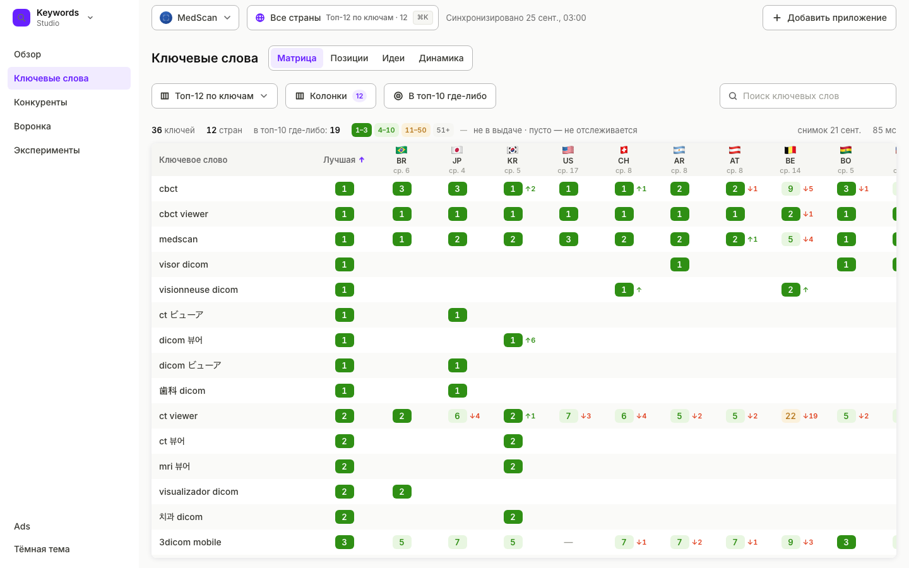
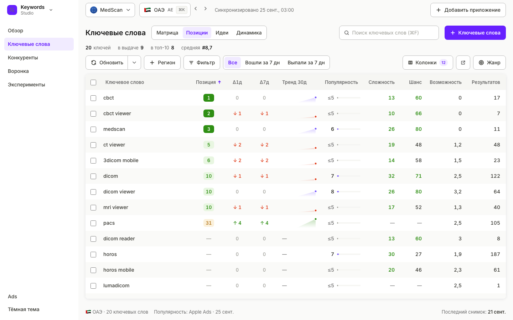
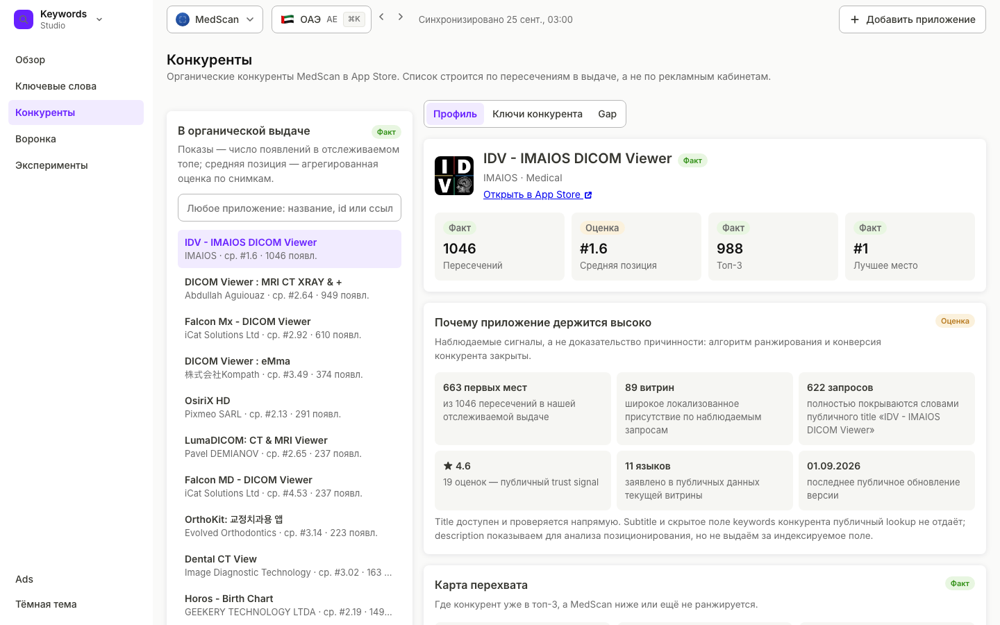
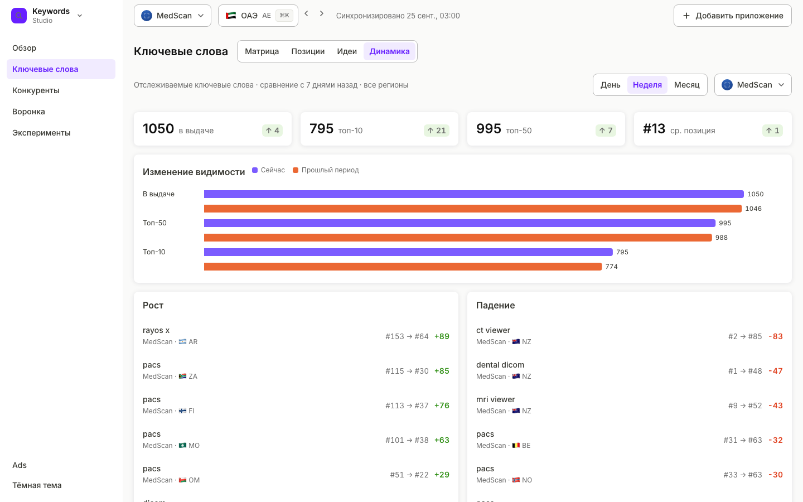
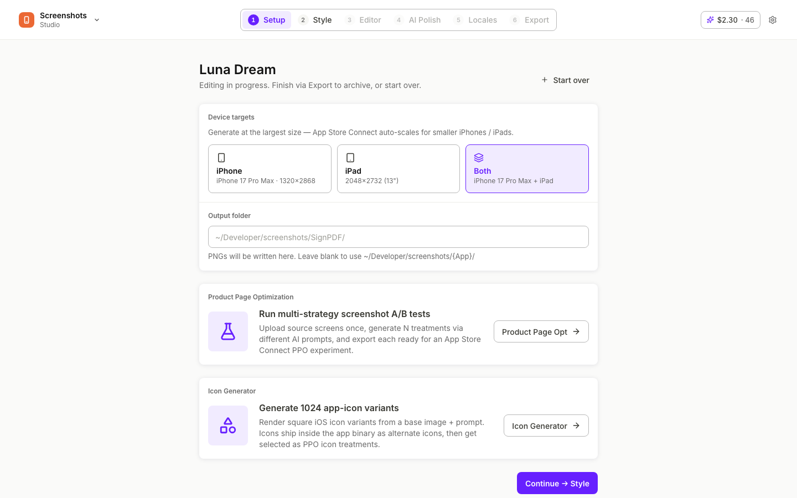
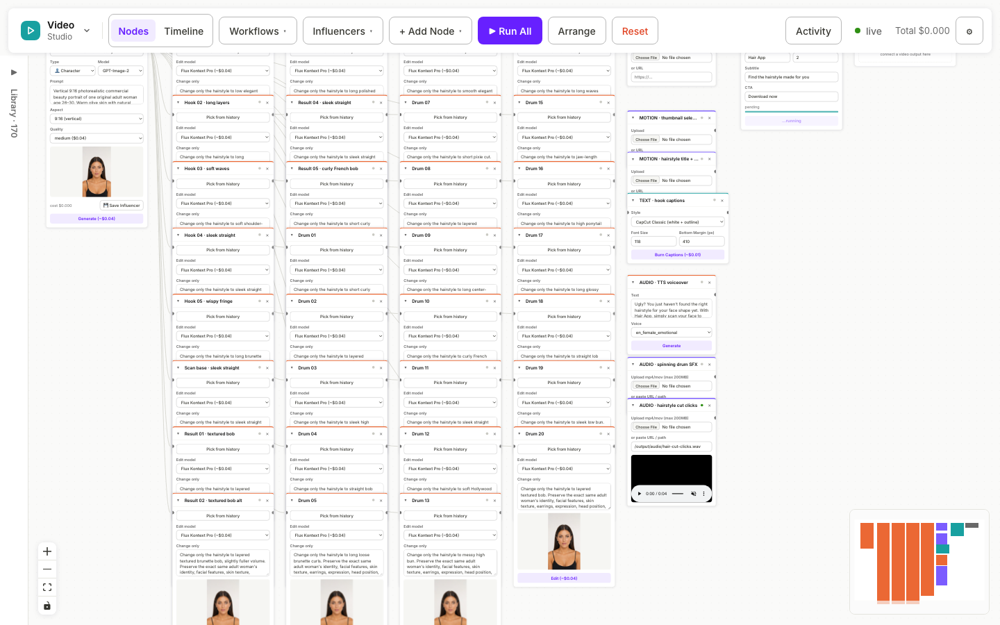
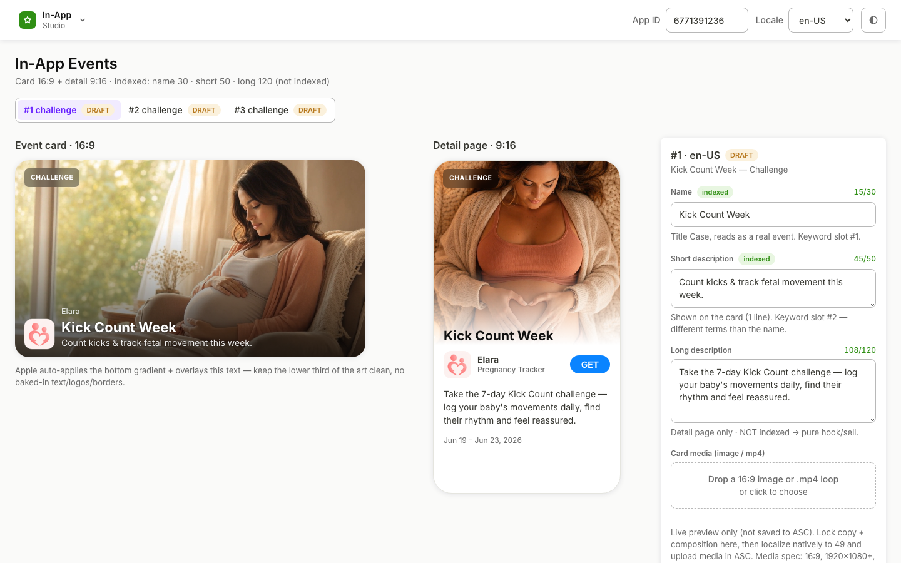

# ASO Studio

> A self-hosted App Store toolkit for indie iOS developers. It covers **keyword rank tracking, Apple Ads, screenshots and PPO, video ads, and In-App Events**, served as one local app. It pairs well with [Claude Code](https://claude.com/claude-code): every state file and API is agent-readable, so an AI co-pilot can work on your App Store presence alongside you.

It runs on your machine, stores everything locally, and talks only to Apple and to the AI providers you choose.



## What's inside

Five products behind **one gateway on one port** (`localhost:5173`), switched from the top-left menu. Each product starts lazily the first time you open it, and an idle UI unloads itself.

| Product | Path | What it does |
|---|---|---|
| **Keywords** | `/` | Rank tracking in all 175 App Store storefronts, taken from the same search the App Store app runs (up to 250 positions). Country matrix, per-storefront positions, keyword ideas, competitor spy, dynamics, acquisition funnel, metadata experiments. |
| **Ads** | `/asa/` | Apple Ads (Search Ads) analytics: keyword economics, traffic intelligence, geo heatmap, search-term cleanup, and single-term keyword popularity (5–100). Read-only by default; bid mutations are fail-closed. |
| **Screenshots** | `/studio/` | App Store screenshot generator: presets, device frames, headline overlays, AI polish (fal.ai gpt-image-2), locale translation, a multi-strategy PPO treatment generator and an icon-variant generator. |
| **Video** | `/video/` | Node-based pipeline for UGC video ads: script → images → voiceover → captions → export. |
| **In-App** | `/inapp/` | In-App Event designer: 16:9 card and 9:16 detail previews with live character limits for indexed fields. |

### Keywords

| Positions in one storefront | Competitor profile |
|---|---|
|  |  |

- **Country matrix**: every tracked keyword × every storefront in one grid, with 7-day deltas. ⌘K switches country; ⌘[ / ⌘] step through storefronts.
- **Positions**: one storefront with popularity (Apple Ads 5–100), difficulty, chance, opportunity, the top-5 apps, a 30-day trend, tags and notes. Filters, column layout and CSV export.
- **App Store rank source**: ranks come from the storefront's native search order, which matches what users see on the device. The old iTunes Search API is still available as a fallback and for comparison (`/api/rank-source/compare`).
- **Rate-limit aware**: every Apple call goes through a per-host adaptive gate. It starts at 24/min, grows to 40/min while responses stay clean, and halves with a 5-minute pause on 403/429. Identical requests are coalesced, and metadata lookups are batched up to 150 ids with a 24 h cache.
- **Nightly delta refresh** (04:00 local, `KEYWORDS_NIGHTLY_HOUR`): the top 50, new keywords and a probe set are refreshed daily; the long tail is refreshed weekly by weekday.
- **Competitor spy**: gap analysis against any app across App Store results up to 250 deep.
- **Ideas**: Apple autocomplete, competitor titles and Apple Ads recommendations, scored and filtered for brands.



### Screenshots, Video, In-App

| Screenshots | Video | In-App Events |
|---|---|---|
|  |  |  |

## Quickstart

```bash
git clone https://github.com/dsm5e/aso-tracker.git aso-studio
cd aso-studio
npm install        # installs all five workspaces
npm run dev        # one gateway: http://localhost:5173
```

Gateway environment variables: `STUDIO_PORT` (5173), `STUDIO_HOST` (127.0.0.1), `STUDIO_IDLE_MIN` (15; 0 keeps every UI loaded). `npm run dev:legacy` still starts the old one-process-per-product setup.

First run:
1. **Keywords → Add app**: paste the App Store id, add a storefront and a few keywords, then press **Обновить** (Refresh).
2. Screens that need a third-party account show a **Connect** card in their place. It lists the keys that are required and where to get them, and includes a ready-made prompt you can hand to an agent.
3. **Screenshots**: settings (gear icon) → paste `FAL_API_KEY` for AI renders and `OPENAI_API_KEY` for translations.

### Headless snapshots

```bash
npm --workspace aso-keywords run snapshot -- --app=<id>                 # every storefront of one app
npm --workspace aso-keywords run snapshot -- --app=<id> --locales=us,de
npm --workspace aso-keywords run snapshot                               # every app
```

### Optional: second egress for rank refresh

`tools/egress-worker/` contains a Cloudflare Worker template. Deployed under your own account, it adds a second request lane to the rank gate. It is off unless you configure it; see its README.

## Keys and data stay on your machine

Nothing is committed and nothing leaves your machine, except calls to Apple and to the AI provider you invoke.

| What | Where |
|---|---|
| AI keys (fal.ai, OpenAI) | `~/.aso-studio/keys.json`, mode 0600. An environment variable overrides it. |
| Apple Ads / App Store Connect / Adapty credentials | the Ads product's local SQLite (`asa-ads/data/`, gitignored) or environment variables. The UI only sees masked previews. |
| Rank history, caches, schedule | `~/.aso-studio/keywords/` (SQLite, outside the repo) |
| Editor state, exports, video outputs | `~/.aso-studio/` |

The repo's `.gitignore` excludes `*.db`, `*.sqlite`, `.env*` and every `data/` folder. There is no telemetry, no analytics, and no backend of ours.

Outbound calls: App Store search and lookup (public, no keys); Apple Ads, App Store Connect and Adapty APIs (only with your credentials); fal.ai and OpenAI (only when you click generate or translate).

## Works with Claude Code

Every product exposes a local REST API, and editor state is plain JSON under `~/.aso-studio/`, so an agent can read and drive the studio directly. Two MCP servers complement it:

- **`asc-mcp`** ([dsm5e/nomly-asc-mcp](https://github.com/dsm5e/nomly-asc-mcp)) for the full App Store Connect API: metadata, localizations, screenshots, IAP and subscriptions, PPO, custom product pages, reviews.
- **`apple-search-ads-mcp`** ([AppVisionOS](https://github.com/AppVisionOS/apple-search-ads-mcp)) for the Apple Ads Campaign Management API.

Typical agent jobs: audit metadata against tracked ranks, research keywords per storefront, generate and export a localized screenshot set, design PPO treatments, and review Apple Ads keyword economics. The Ads API surface is documented in [`asa-ads/README.md`](asa-ads/README.md). The full architecture context for agents is in [`llms-full.txt`](llms-full.txt).

## Keyword methodology

Track **search phrases** (2–4 words) that people actually type, not the single words in the ASC keywords field. Localize by **intent**, not literal translation. For example, Turkish users search `rüya tabiri` ("dream interpretation"), not `rüya günlüğü` ("dream journal").

## Tech stack

React 19 + Vite + TypeScript. Express + better-sqlite3 + Sharp. The one-port gateway (`studio/server.ts`) mounts each product's API in-process and runs its Vite in middleware mode. The shared design system lives in `shared/` (`ds.css`, charts, studio switcher); see [`DESIGN.md`](DESIGN.md).

## License

MIT — see [LICENSE](LICENSE).
